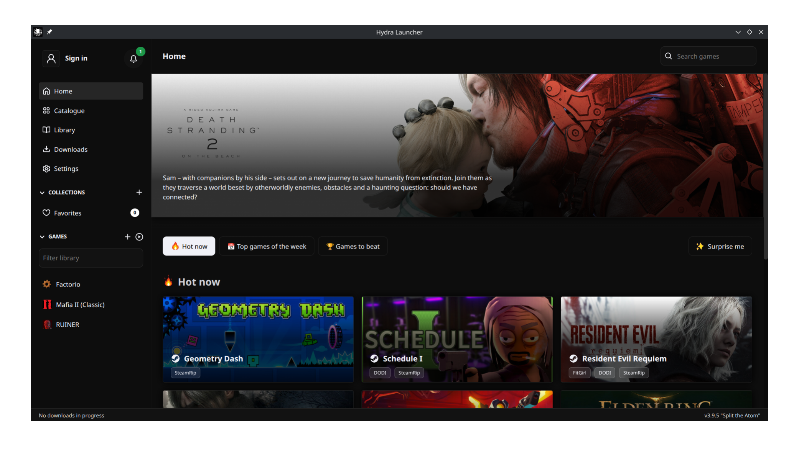
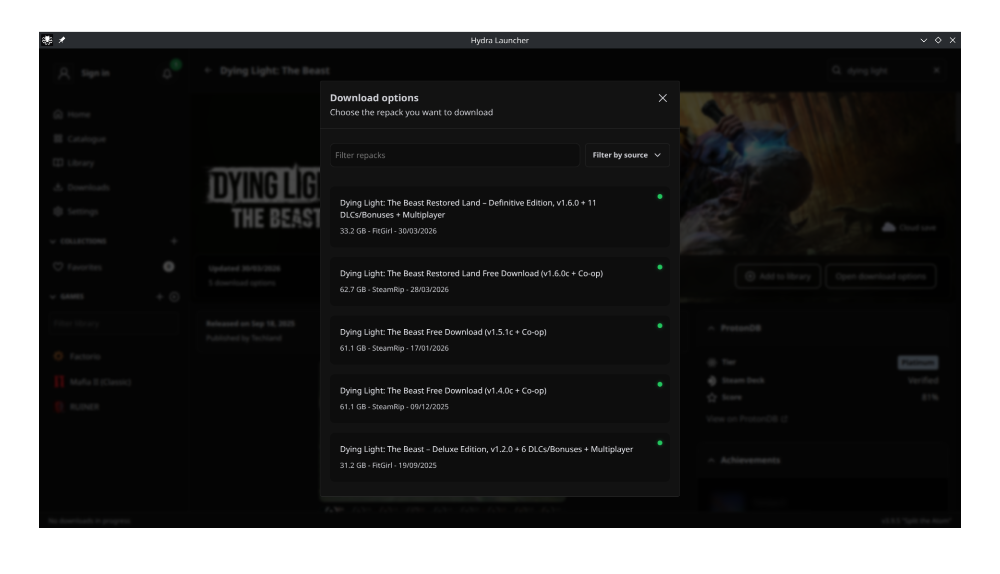
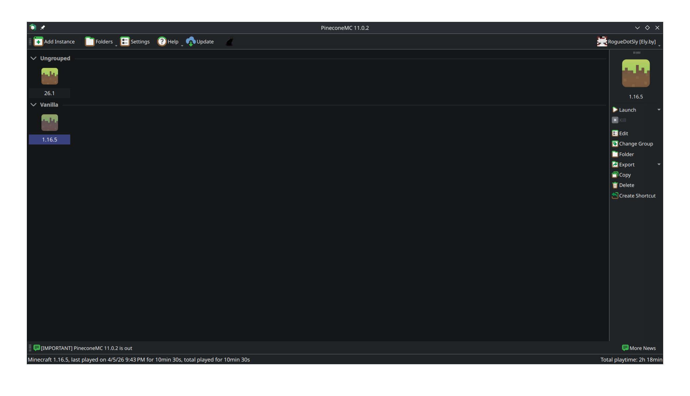
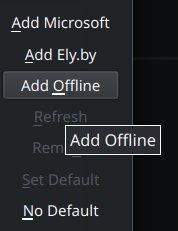
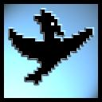
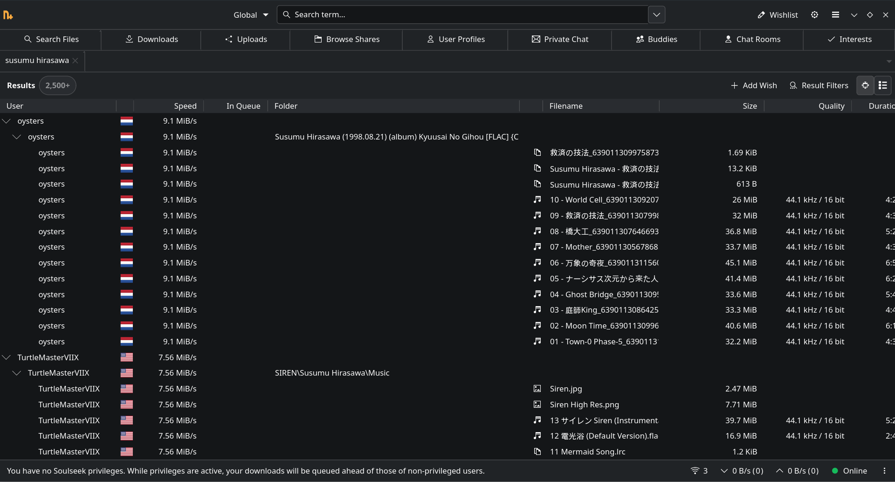

## Introduction

Hello my dear reader! Today I'll give you a guide on how to pirate stuff online :D. Sounds fun right?

However, before I go into the topic I need to give a disclaimer first:

- If you're in a good financial position, I highly recommend to just buy whatever you wanna get. Especially if whoever you're getting your stuff from is an indie developer or small music creator.

- This guide is intended for people living in a 3rd world shithole like mine. I'm a bearer of knowledge and I wanna share that knowledge with people like me. If you happen to be living somewhere where that stuff is considered illegal by your local law, then it's highly recommended not to do it (just so you don't end up in trouble).

- With piracy, you need to understand that there's always risk and there's always a chance of something going wrong like wasting an entire week downloading a pirated copy of Cyberpunk2077 only for that game not to work or having some kind of game breaking bug that you can't easily "update" since you don't own the game OR even worse! Your PC getting infected with malware of some sort

And with that out of the way, let's get into the fun stuff shall we?

## Things to cover

Here's a list of what I'm going to cover today:

1. 🎮 Video Games
2. 🎵 Music
3. 📺 Cartoon & Anime

### Video Games

You love video games right? And so I do, but you don't wanna go and dive through many sketchy websites and have to deal with annoying pop up ads that bypasses the best of AD blockers? Well I got you covered.

####  [Hydralauncher](https://hydralauncher.gg)

Hydralauncher is an open source games launcher for Windows and Linux.

Hydralauncher by itself doesn't handle setting up the sources for you. You'll have to get these sources on your end. Go to [hydra.library](https://library.hydra.wiki/sources) to find these sources.

Click on `install` button to add a source to Hydralauncher, a popup menu will appear in your browser asking to use hydralauncher. Alternatively, you can just `copy` the link to the source and add it yourself manually in the launcher.

I recommend the following sources:

- FitGirl
- DODI
- SteamRIP
- Free GOG

Once you have these sources added, you can start downloading some games :D

####  Minecraft (PineconeMC)

PineconeMC (or formerly ElyPrismLauncher) is a fork of... you guessed it! PrismLauncher. It's pretty much the same exact thing except you don't have to own a Minecraft account to be able to play the game.

PineconeMC comes with [ely.by](https://ely.by/) service which allows you to have stuff like custom skins and fellow pirate friends list. Its not mandatory to play the game. You can just select offline account and you should be good to go!

#### Console Games

I'm only gonna show you how to get those games. Running those games is an issue you'll have to deal with on your end. I don't think you'll have much trouble running those games tho.

For most console games, [vimm's lair](https://vimm.net/) is all you need, but here's a list of notable sources:

- [r-roms.github.io](https://r-roms.github.io/)
- [fmhy.net](https://fmhy.net/)

### Music

####  [Soulseek](https://www.slsknet.org)

This is by far, the most reliable way to download high quality music. Given that it's a peer-to-peer network, the speed may vary. Don't forget to share some of the music you have by the way. Sharing is caring!

####  [Nicotine+](https://nicotine-plus.org/)

This is just an alternative GUI for Soulseek. It's what I personally use.

### Cartoons & Anime

For this I would recommend [wco.tv](https://www.wco.tv/).

I don't see much point in saving whole cartoons as I only watch them once and never again. Its only a good idea, if you wanna have a media server that you want to share with your family members, but for just watching stuff on your own? I think this is more than enough.

### Conclusion

If you wanna dive deeper into the world of piracy, I recommend [reading the megathread](https://www.reddit.com/r/Piracy/wiki/megathread/).

Thanks for reading :)
